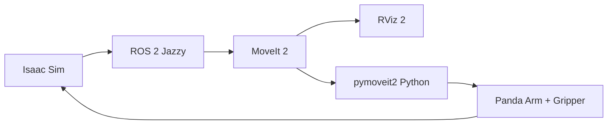
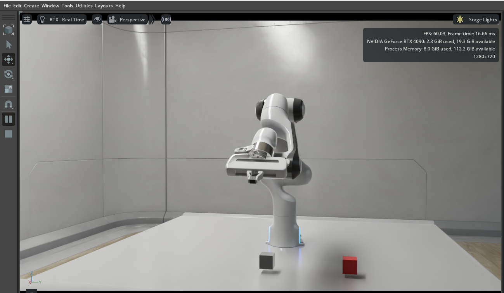
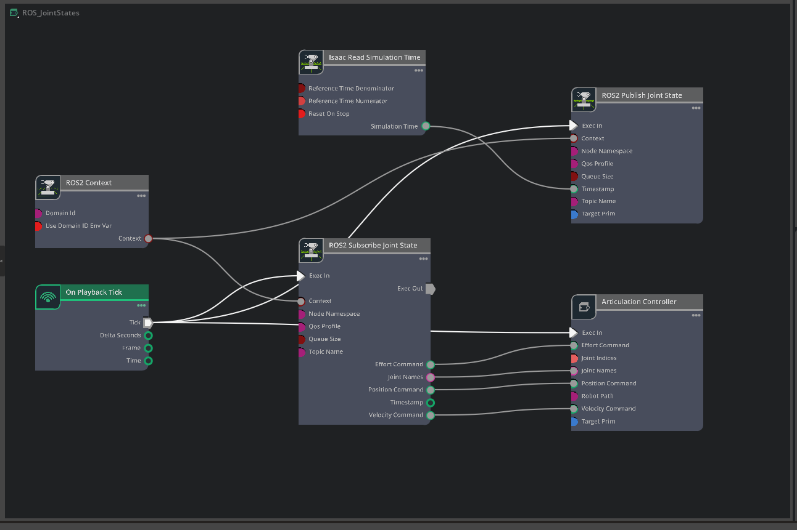
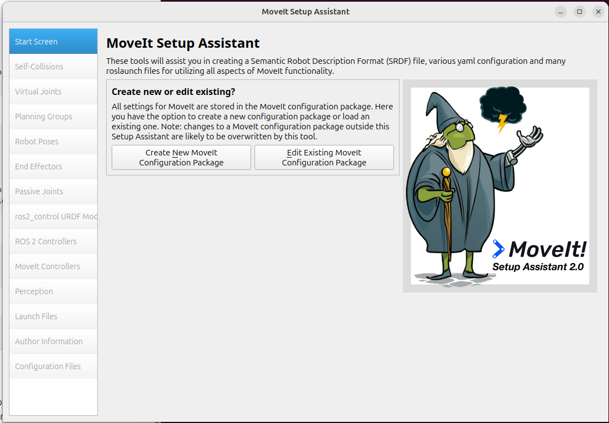

# Franka Panda Pick and Place

A simple robotics project using **NVIDIA Isaac Sim, ROS 2 Jazzy, MoveIt 2, RViz 2 and pymoveit2**.

## What this project does

The Franka Panda robot:

1. Starts in Isaac Sim.
2. Connects to ROS 2.
3. MoveIt 2 plans the robot motion.
4. RViz is used to view and test the robot.
5. Python (`pymoveit2`) controls the pick-and-place sequence.
6. The robot picks the **black cube** and places it on the **red cube**.

## Simple system flow



## My work

### 1. Isaac Sim

I created a Panda robot scene with:

- Table
- Black pickup cube
- Red target cube
- ROS 2 communication using OmniGraph



### 2. Isaac Sim ROS 2 connection

The OmniGraph is used to send and receive Panda joint information between Isaac Sim and ROS 2.



### 3. MoveIt 2 and RViz

I used MoveIt Setup Assistant to create the Panda MoveIt configuration.



The configuration contains:

- Panda robot description
- Planning group
- Joint limits
- Kinematics
- Controllers
- RViz configuration
- Launch files

### 4. Panda robot model

The Panda URDF/Xacro defines the robot links and joints:

```text
panda_link0
   |
panda_joint1
   |
panda_link1
   |
   ...
   |
panda_link7
   |
panda_link8
   |
panda_hand
   |
panda_fingers
```

The main arm joints are:

```text
panda_joint1
panda_joint2
panda_joint3
panda_joint4
panda_joint5
panda_joint6
panda_joint7
```

The gripper uses:

```text
panda_finger_joint1
panda_finger_joint2
```

The project uses the MoveIt Panda description package for the robot meshes and base URDF.

### 5. Pick and place

```text
Start
  ↓
Open gripper
  ↓
Move to black cube
  ↓
Close gripper
  ↓
Lift black cube
  ↓
Move to red target
  ↓
Lower cube
  ↓
Open gripper
  ↓
Finish
```

## Main software

| Software | Purpose |
|---|---|
| Isaac Sim | Robot simulation |
| ROS 2 Jazzy | Communication |
| MoveIt 2 | Motion planning |
| RViz 2 | Robot visualization |
| pymoveit2 | Python control |
| MoveIt Setup Assistant | MoveIt configuration |

## Project files

```text
panda-isaacsim-moveit2-pick-place/
├── README.md
├── panda_moveit_config/
│   ├── config/
│   ├── launch/
│   ├── CMakeLists.txt
│   └── package.xml
└── docs/
    ├── commands.md
    ├── panda_urdf.md
    └── images/
```

## Run the project

### RViz + MoveIt

Open a terminal:

```bash
source /opt/ros/jazzy/setup.bash
source ~/ws_moveit2/install/setup.bash
source ~/TUT13/panda_moveit_config/install/setup.bash
ros2 launch panda_moveit_config demo.launch.py
```

### Pick and place

Open another terminal:

```bash
source /opt/ros/jazzy/setup.bash
source ~/ws_moveit2/install/setup.bash
source ~/pymoveit2_ws/install/setup.bash
source ~/TUT13/panda_moveit_config/install/setup.bash
python3 ~/pymoveit2_ws/src/pick_place/scripts/pick_place.py
```

## Important ROS interfaces

```text
/joint_states
/isaac_joint_states
/isaac_joint_commands
/panda_arm_controller/follow_joint_trajectory
/panda_gripper_controller/gripper_cmd
```

## Project goal

The goal of this project was to understand and demonstrate how a simulated Franka Panda can be controlled using **Isaac Sim + ROS 2 + MoveIt 2 + RViz + Python** for a basic manipulation task.

