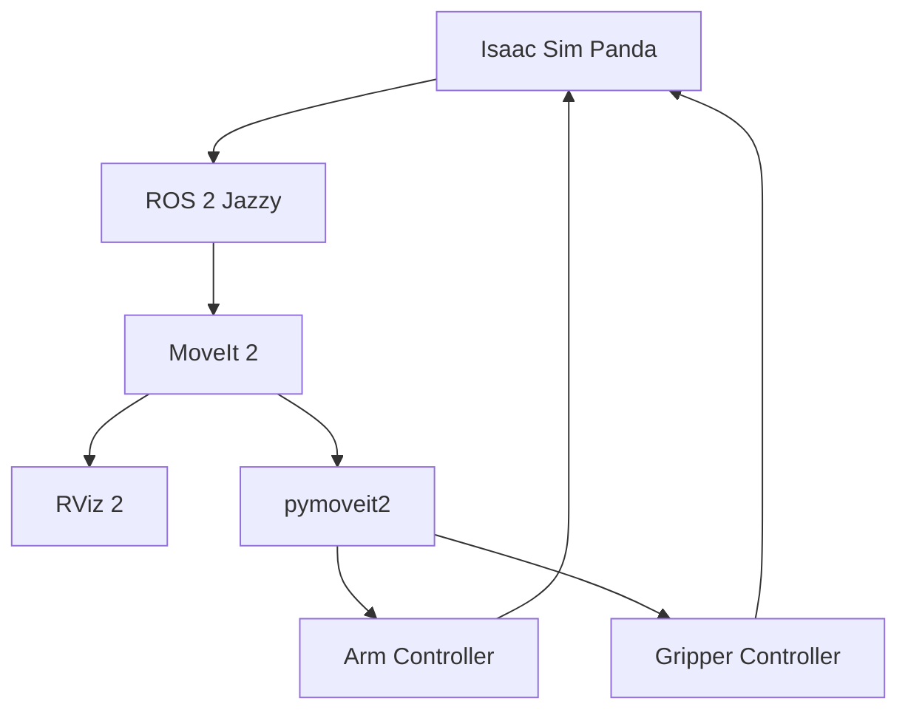

# Simple Architecture

### In simple words

- **Isaac Sim**: shows and simulates the Panda.
- **ROS 2**: connects the different programs.
- **MoveIt 2**: plans robot movement.
- **RViz**: shows the robot and planning information.
- **pymoveit2**: sends the pick-and-place commands from Python.
- **Controllers**: move the simulated arm and gripper.
